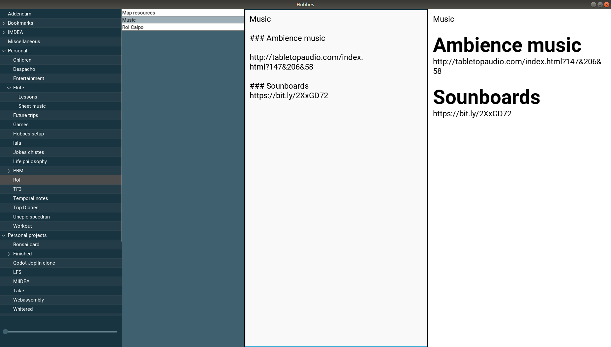

# Hobbes desktop

My own notetaking application.

**Features**:

* Notes are written in Markdown
* There is no fancy fileformat, just plain folders and txt files
* Version control using git
* If the origin is set on git, you get online backups as well (gitlab, github, bitbucket...)
* You can have multiple note sources 
* Fast note search using Whoosh (ctrl + G to activate)
* Note view, Renderer view or Split view update in realtime (ctrl + l to toggle)
* There is a tiny slider on the bottom left that plays rain sounds when volume > 0 (if volume is zero the sound stops all together)
* Crossplatform (Linux, Windows, Mac)




## How to build in Windows

1. Install [Python 3.x](https://www.python.org/downloads/release/python-383/) make sure it is added to the path
2. Install virtualenv
	```
	python -m pip install virtualenv
	```
3. Create the virtual environment
	```
	 python -m venv C:\Users\Gef\Documents\venv_hobbes_python
	```
4. Activate the environment
	```
	C:\Users\Gef\Documents\venv_hobbes_python\Scripts\activate.bat
	```
5. Install the requirements
	```
	python -m pip install -r .\requirements_windows.txt
	```

6. Install git
	```
	https://gitforwindows.org/
	```
7. Install PyInstaller
	```
	python -m pip install pyinstaller
	```
	
8. Build the application
	```
	python -m PyInstaller .\main_windows.spec
	```

9. Bundle the app
	```
	Copy everything from the dist/main folder into the build/main folder
	```
	
10. Your app is in the folder build/main

## Dependencies

```
sudo apt-get install xclip xsel
```

## How to configure remote git

By defaul Hobbes creates a local git if no git has been created. If you want to add a remote do:

```
git remote add origin git@github.com:pjimenezmateo/Personal_test.git
git push -u origin master
```

You should also have the SSH keys correctly configured

## How to build

```
python -m pip install --upgrade --user pip setuptools virtualenv

# Activate environment:

source ~/kivy_venv/bin/activate

# Install dependencies
pip install -r requirements.txt

pip install pyinstaller

# Build
pyinstaller main.spec

# Bundle all on one folder
cp -r dist/main/* build/main/*

# Run
build/main/main
```

The package will be under build/main

## Rain sound
Downloaded from https://freetousesounds.bandcamp.com/album/city-rain-sounds-empty-streets-relaxing-sound-effects and adapted to a perfect loop using Audacity.
